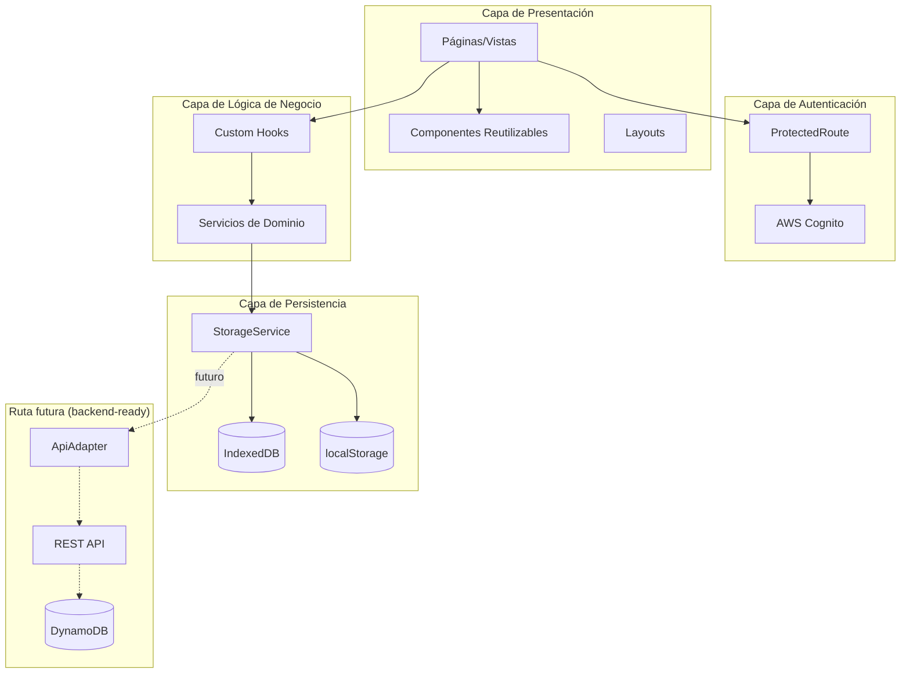
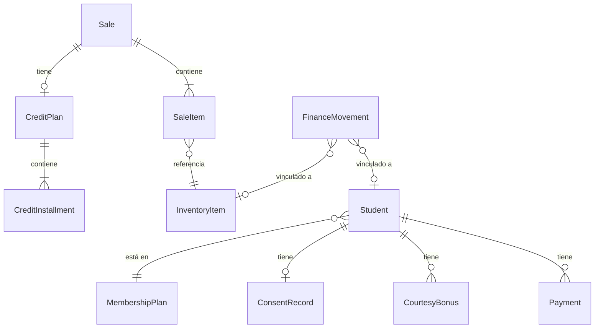

# Design Document: GymOps Web Application (Meraki)

## Overview

GymOps es una aplicación web de gestión para academias de artes marciales, desarrollada por Memento Coding. Este diseño describe la refactorización del sistema monolítico actual (~3280 líneas en un solo archivo HTML con React incrustado) hacia una aplicación moderna con React 18, TypeScript, Vite y arquitectura modular.

La aplicación gestiona el ciclo de vida completo de una academia: estudiantes, membresías, pagos, consentimiento informado, finanzas, inventario, ventas (contado y crédito), cortesías, comunicación multicanal (Email → Telegram → WhatsApp en fases) y generación de comprobantes PDF.

### Decisiones clave de diseño

1. **Client-side con abstracción backend-ready**: La aplicación opera 100% frontend con persistencia local (IndexedDB + localStorage), pero la capa de persistencia está diseñada con una interfaz abstraída que permite migrar a endpoints de API (DynamoDB) sin modificar la lógica de negocio ni los componentes de UI.
2. **Migración de datos**: Compatible con el formato de backup JSON existente (`gymops_backup_YYYY-MM-DD.json`).
3. **Comunicación por fases**: Interfaz abstraída de canales que permite implementar Email (Fase 1), Telegram (Fase 2) y WhatsApp (Fase 3) de forma incremental.
4. **Formulario configurable**: El formulario de registro de estudiantes es dinámico — los campos se definen en configuración y se renderizan en tiempo de ejecución.
5. **UI Component Library**: shadcn/ui con Tailwind CSS como sistema de componentes. Los componentes se copian al proyecto (no son dependencia externa), usan Radix UI primitives para accesibilidad, y se integran con el design system de tokens CSS y Framer Motion para animaciones.
6. **Autenticación con AWS Cognito**: El acceso al sistema está protegido mediante AWS Cognito User Pools con soporte para email/password y Google OAuth. Los tokens JWT se gestionan client-side con refresh automático. La librería `aws-amplify/auth` maneja la integración.

## Architecture

### Arquitectura de alto nivel



### Estructura del proyecto

```
tailwind.config.ts                  # Tailwind CSS configuration (maps CSS tokens)
src/
├── main.tsx                    # Entry point
├── App.tsx                     # Router principal
├── lib/
│   └── utils.ts                    # cn() utility (clsx + tailwind-merge)
├── types/
│   ├── student.ts
│   ├── membership.ts
│   ├── payment.ts
│   ├── consent.ts
│   ├── finance.ts
│   ├── inventory.ts
│   ├── sale.ts
│   ├── communication.ts
│   ├── courtesy.ts
│   └── settings.ts
├── services/
│   ├── auth/
│   │   ├── AuthService.ts           # Wrapper sobre Amplify Auth
│   │   ├── AuthProvider.tsx         # React context para sesión
│   │   └── ProtectedRoute.tsx       # HOC para rutas protegidas
│   ├── storage/
│   │   ├── StorageService.ts       # Interfaz unificada CRUD
│   │   ├── IndexedDBAdapter.ts     # Adaptador IndexedDB (actual)
│   │   ├── LocalStorageAdapter.ts  # Adaptador/fallback localStorage
│   │   └── ApiAdapter.ts           # Placeholder: futuro adaptador REST → DynamoDB
│   ├── StudentService.ts
│   ├── MembershipService.ts
│   ├── PaymentService.ts
│   ├── ConsentService.ts
│   ├── FinanceService.ts
│   ├── InventoryService.ts
│   ├── SaleService.ts
│   ├── CommunicationService.ts
│   ├── CourtesyService.ts
│   ├── ReceiptService.ts
│   └── BackupService.ts
├── services/communication/
│   ├── ChannelInterface.ts         # Interfaz abstraída
│   ├── EmailChannel.ts             # Fase 1
│   ├── TelegramChannel.ts          # Fase 2
│   └── WhatsAppChannel.ts          # Fase 3
├── hooks/
│   ├── useStudents.ts
│   ├── useMemberships.ts
│   ├── usePayments.ts
│   ├── useConsent.ts
│   ├── useFinance.ts
│   ├── useInventory.ts
│   ├── useSales.ts
│   ├── useCommunication.ts
│   ├── useCourtesies.ts
│   ├── useSettings.ts
│   └── usePersistence.ts
├── pages/
│   ├── LoginPage.tsx
│   ├── RegisterPage.tsx
│   ├── ForgotPasswordPage.tsx
│   ├── DashboardPage.tsx
│   ├── StudentsPage.tsx
│   ├── FinancePage.tsx
│   ├── CourtesiesPage.tsx
│   ├── CommunicationPage.tsx
│   ├── ConsentPage.tsx
│   └── SettingsPage.tsx
├── components/
│   ├── ui/                          # shadcn/ui components (copy-paste, owned)
│   │   ├── button.tsx
│   │   ├── input.tsx
│   │   ├── dialog.tsx
│   │   ├── sheet.tsx
│   │   ├── table.tsx
│   │   ├── badge.tsx
│   │   ├── card.tsx
│   │   ├── select.tsx
│   │   ├── tabs.tsx
│   │   ├── dropdown-menu.tsx
│   │   ├── toast.tsx
│   │   ├── form.tsx
│   │   ├── label.tsx
│   │   ├── popover.tsx
│   │   ├── command.tsx             # Search/command palette
│   │   ├── data-table.tsx          # Table with sorting/filtering
│   │   └── calendar.tsx
│   ├── common/                      # GymOps custom components (compose shadcn)
│   │   ├── MoneyInput.tsx
│   │   ├── ConfirmDialog.tsx
│   │   ├── SearchBar.tsx
│   │   └── FilterBar.tsx
│   ├── students/
│   │   ├── StudentList.tsx
│   │   ├── StudentProfile.tsx
│   │   ├── StudentForm.tsx         # Renderizador dinámico
│   │   └── StudentFilters.tsx
│   ├── payments/
│   │   ├── PaymentForm.tsx
│   │   ├── SplitPaymentEditor.tsx
│   │   └── PaymentHistory.tsx
│   ├── finance/
│   │   ├── FinanceOverview.tsx
│   │   ├── FinanceMovements.tsx
│   │   └── TransferForm.tsx
│   ├── inventory/
│   │   ├── InventoryList.tsx
│   │   └── InventoryForm.tsx
│   ├── sales/
│   │   ├── SaleForm.tsx
│   │   ├── CreditPlanEditor.tsx
│   │   └── SaleHistory.tsx
│   ├── consent/
│   │   ├── ConsentViewer.tsx
│   │   ├── SignatureCanvas.tsx
│   │   └── ConsentPDF.tsx
│   ├── communication/
│   │   ├── TemplateEditor.tsx
│   │   ├── ChannelSelector.tsx
│   │   └── MessagePreview.tsx
│   ├── dashboard/
│   │   ├── MetricsCards.tsx
│   │   ├── AlertsList.tsx
│   │   ├── BirthdayNotification.tsx
│   │   └── MonthlyChart.tsx
│   └── settings/
│       ├── BrandingForm.tsx
│       ├── PlanEditor.tsx
│       ├── FormFieldConfig.tsx
│       └── BackupManager.tsx
└── utils/
    ├── dates.ts
    ├── money.ts
    ├── validation.ts
    ├── templates.ts
    └── receipt.ts
```

### Enrutamiento

Se utiliza React Router v6 con las siguientes rutas:

| Ruta | Página | Descripción |
|------|--------|-------------|
| `/` | DashboardPage | Métricas y alertas |
| `/estudiantes` | StudentsPage | CRUD de estudiantes |
| `/estudiantes/:id` | StudentProfile | Perfil individual |
| `/finanzas` | FinancePage | Movimientos financieros |
| `/cortesias` | CourtesiesPage | Gestión de bonos |
| `/comunicacion` | CommunicationPage | Plantillas y envío |
| `/consentimiento` | ConsentPage | Gestión de consentimiento |
| `/ajustes` | SettingsPage | Configuración del sistema |
| `/login` | LoginPage | Inicio de sesión (pública) |
| `/registro` | RegisterPage | Registro de admin (pública) |
| `/recuperar-password` | ForgotPasswordPage | Recuperar contraseña (pública) |

## UX/UI Design System

### Design Philosophy

GymOps adopta un diseño **limpio, moderno y profesional** optimizado para interfaces densas en datos sin caer en sensación de desorden. Los principios rectores son:

- **Data-density balanceada**: Máxima información visible sin sacrificar legibilidad. Uso estratégico de whitespace para agrupar, no para decorar.
- **Mobile-responsive**: Diseño mobile-first que escala hacia desktop. Las operaciones más frecuentes (búsqueda de estudiantes, registro de pagos) deben ser cómodas en smartphone.
- **Quick data entry**: Formularios optimizados para entrada rápida — tabulación lógica, autocompletado, valores por defecto inteligentes.
- **Scanning-first**: Jerarquía visual clara con tipografía, color y espaciado que permita escanear listas y tablas sin leer cada palabra.
- **Profesionalismo sin frialdad**: Transmitir confianza y energía (contexto fitness) sin parecer una app de consumo. Es una herramienta de trabajo, no una red social.

---

### Color Palette

La paleta está diseñada para transmitir **energía, profesionalismo y confianza** — valores centrales del contexto fitness/gimnasio — mientras funciona como base neutral para una interfaz administrativa densa en datos.

**Rationale**: Se eligió un azul-índigo profundo como primario (confianza, estabilidad, profesionalismo) combinado con un naranja energético como acento (energía, acción, motivación). Esta combinación evita los clichés de rojo/negro del fitness mientras mantiene vitalidad.

#### Primary — Índigo Profundo

Transmite confianza, estabilidad y seriedad profesional. Funciona como color dominante en navegación, headers y acciones principales.

| Token | Light Mode | Dark Mode | Uso |
|-------|-----------|-----------|-----|
| `--color-primary-50` | `#eef2ff` | `#1e1b4b` | Background sutil |
| `--color-primary-100` | `#e0e7ff` | `#312e81` | Hover background |
| `--color-primary-200` | `#c7d2fe` | `#3730a3` | Bordes activos |
| `--color-primary-500` | `#6366f1` | `#818cf8` | Texto/iconos sobre fondo |
| `--color-primary-600` | `#4f46e5` | `#a5b4fc` | Botones primarios, links |
| `--color-primary-700` | `#4338ca` | `#c7d2fe` | Hover de botones |
| `--color-primary-900` | `#312e81` | `#eef2ff` | Texto sobre fondos claros |

#### Secondary — Slate

Neutral sofisticado para textos, bordes y fondos. Evita el gris puro que resulta apagado.

| Token | Light Mode | Dark Mode | Uso |
|-------|-----------|-----------|-----|
| `--color-secondary-50` | `#f8fafc` | `#0f172a` | Background principal app |
| `--color-secondary-100` | `#f1f5f9` | `#1e293b` | Background cards/panels |
| `--color-secondary-200` | `#e2e8f0` | `#334155` | Bordes, divisores |
| `--color-secondary-300` | `#cbd5e1` | `#475569` | Texto placeholder |
| `--color-secondary-500` | `#64748b` | `#94a3b8` | Texto secundario |
| `--color-secondary-700` | `#334155` | `#e2e8f0` | Texto principal body |
| `--color-secondary-900` | `#0f172a` | `#f8fafc` | Texto headings |

#### Accent — Naranja Energético

Transmite energía, acción y motivación. Se usa con moderación para CTAs secundarios, highlights y elementos que requieren atención.

| Token | Light Mode | Dark Mode | Uso |
|-------|-----------|-----------|-----|
| `--color-accent-50` | `#fff7ed` | `#431407` | Background notificaciones |
| `--color-accent-100` | `#ffedd5` | `#7c2d12` | Badge background |
| `--color-accent-400` | `#fb923c` | `#f97316` | Iconos destacados |
| `--color-accent-500` | `#f97316` | `#fb923c` | CTA secundario |
| `--color-accent-600` | `#ea580c` | `#fdba74` | Hover accent |

#### Semantic Colors

| Token | Light Mode | Dark Mode | Uso |
|-------|-----------|-----------|-----|
| `--color-success-50` | `#f0fdf4` | `#052e16` | Background success |
| `--color-success-500` | `#22c55e` | `#4ade80` | Icono/texto éxito |
| `--color-success-700` | `#15803d` | `#86efac` | Texto sobre fondo success |
| `--color-warning-50` | `#fffbeb` | `#451a03` | Background warning |
| `--color-warning-500` | `#f59e0b` | `#fbbf24` | Icono/texto advertencia |
| `--color-warning-700` | `#b45309` | `#fcd34d` | Texto sobre fondo warning |
| `--color-error-50` | `#fef2f2` | `#450a0a` | Background error |
| `--color-error-500` | `#ef4444` | `#f87171` | Icono/texto error |
| `--color-error-700` | `#b91c1c` | `#fca5a5` | Texto sobre fondo error |
| `--color-info-50` | `#eff6ff` | `#172554` | Background info |
| `--color-info-500` | `#3b82f6` | `#60a5fa` | Icono/texto informativo |
| `--color-info-700` | `#1d4ed8` | `#93c5fd` | Texto sobre fondo info |

#### CSS Custom Properties

```css
:root {
  /* Primary - Índigo */
  --color-primary-50: #eef2ff;
  --color-primary-100: #e0e7ff;
  --color-primary-200: #c7d2fe;
  --color-primary-500: #6366f1;
  --color-primary-600: #4f46e5;
  --color-primary-700: #4338ca;
  --color-primary-900: #312e81;

  /* Secondary - Slate */
  --color-secondary-50: #f8fafc;
  --color-secondary-100: #f1f5f9;
  --color-secondary-200: #e2e8f0;
  --color-secondary-300: #cbd5e1;
  --color-secondary-500: #64748b;
  --color-secondary-700: #334155;
  --color-secondary-900: #0f172a;

  /* Accent - Orange */
  --color-accent-50: #fff7ed;
  --color-accent-100: #ffedd5;
  --color-accent-400: #fb923c;
  --color-accent-500: #f97316;
  --color-accent-600: #ea580c;

  /* Success */
  --color-success-50: #f0fdf4;
  --color-success-500: #22c55e;
  --color-success-700: #15803d;

  /* Warning */
  --color-warning-50: #fffbeb;
  --color-warning-500: #f59e0b;
  --color-warning-700: #b45309;

  /* Error */
  --color-error-50: #fef2f2;
  --color-error-500: #ef4444;
  --color-error-700: #b91c1c;

  /* Info */
  --color-info-50: #eff6ff;
  --color-info-500: #3b82f6;
  --color-info-700: #1d4ed8;
}

[data-theme="dark"] {
  /* Primary - Índigo (Dark) */
  --color-primary-50: #1e1b4b;
  --color-primary-100: #312e81;
  --color-primary-200: #3730a3;
  --color-primary-500: #818cf8;
  --color-primary-600: #a5b4fc;
  --color-primary-700: #c7d2fe;
  --color-primary-900: #eef2ff;

  /* Secondary - Slate (Dark) */
  --color-secondary-50: #0f172a;
  --color-secondary-100: #1e293b;
  --color-secondary-200: #334155;
  --color-secondary-300: #475569;
  --color-secondary-500: #94a3b8;
  --color-secondary-700: #e2e8f0;
  --color-secondary-900: #f8fafc;

  /* Accent - Orange (Dark) */
  --color-accent-50: #431407;
  --color-accent-100: #7c2d12;
  --color-accent-400: #f97316;
  --color-accent-500: #fb923c;
  --color-accent-600: #fdba74;

  /* Success (Dark) */
  --color-success-50: #052e16;
  --color-success-500: #4ade80;
  --color-success-700: #86efac;

  /* Warning (Dark) */
  --color-warning-50: #451a03;
  --color-warning-500: #fbbf24;
  --color-warning-700: #fcd34d;

  /* Error (Dark) */
  --color-error-50: #450a0a;
  --color-error-500: #f87171;
  --color-error-700: #fca5a5;

  /* Info (Dark) */
  --color-info-50: #172554;
  --color-info-500: #60a5fa;
  --color-info-700: #93c5fd;
}
```

**Nota de accesibilidad**: Todos los pares texto/fondo cumplen con ratio de contraste WCAG AA mínimo (4.5:1 para texto normal, 3:1 para texto grande). Los colores semánticos en modo oscuro son versiones más luminosas para mantener legibilidad sobre fondos oscuros. La validación completa requiere pruebas manuales con tecnologías asistivas y revisión por experto en accesibilidad.

---

### Typography

**Font stack principal**: [Inter](https://rsms.me/inter/) — Sans-serif geométrica optimizada para pantallas, con excelente legibilidad en tamaños pequeños y soporte completo de caracteres latinos.

```css
:root {
  --font-sans: 'Inter', -apple-system, BlinkMacSystemFont, 'Segoe UI', Roboto, sans-serif;
  --font-mono: 'JetBrains Mono', 'Fira Code', 'Consolas', monospace;
}
```

#### Escala tipográfica

Basada en una ratio de 1.25 (Major Third) con base 16px:

| Token | Size | Line Height | Weight | Uso |
|-------|------|-------------|--------|-----|
| `--text-xs` | 0.75rem (12px) | 1rem | 400 | Labels, captions, metadata |
| `--text-sm` | 0.875rem (14px) | 1.25rem | 400 | Texto secundario, inputs |
| `--text-base` | 1rem (16px) | 1.5rem | 400 | Texto body principal |
| `--text-lg` | 1.125rem (18px) | 1.75rem | 500 | Subtítulos de sección |
| `--text-xl` | 1.25rem (20px) | 1.75rem | 600 | Títulos de card/panel |
| `--text-2xl` | 1.5rem (24px) | 2rem | 700 | Títulos de página |
| `--text-3xl` | 1.875rem (30px) | 2.25rem | 700 | Hero metrics (dashboard) |
| `--text-4xl` | 2.25rem (36px) | 2.5rem | 800 | Números destacados |

#### Pesos disponibles

| Token | Weight | Uso |
|-------|--------|-----|
| `--font-normal` | 400 | Texto body, descripciones |
| `--font-medium` | 500 | Labels, nav items, subtítulos |
| `--font-semibold` | 600 | Títulos de sección, botones |
| `--font-bold` | 700 | Headings de página |
| `--font-extrabold` | 800 | Metrics grandes del dashboard |

```css
:root {
  --text-xs: 0.75rem;
  --text-sm: 0.875rem;
  --text-base: 1rem;
  --text-lg: 1.125rem;
  --text-xl: 1.25rem;
  --text-2xl: 1.5rem;
  --text-3xl: 1.875rem;
  --text-4xl: 2.25rem;

  --leading-tight: 1.25;
  --leading-normal: 1.5;
  --leading-relaxed: 1.75;

  --font-normal: 400;
  --font-medium: 500;
  --font-semibold: 600;
  --font-bold: 700;
  --font-extrabold: 800;
}
```

---

### Spacing & Layout

#### Sistema de 8px grid

Todo el espaciado se basa en múltiplos de 4px, con 8px como unidad base:

```css
:root {
  --space-0: 0;
  --space-0.5: 0.125rem;  /* 2px */
  --space-1: 0.25rem;     /* 4px */
  --space-2: 0.5rem;      /* 8px — unidad base */
  --space-3: 0.75rem;     /* 12px */
  --space-4: 1rem;        /* 16px */
  --space-5: 1.25rem;     /* 20px */
  --space-6: 1.5rem;      /* 24px */
  --space-8: 2rem;        /* 32px */
  --space-10: 2.5rem;     /* 40px */
  --space-12: 3rem;       /* 48px */
  --space-16: 4rem;       /* 64px */
  --space-20: 5rem;       /* 80px */
  --space-24: 6rem;       /* 96px */
}
```

#### Border Radius Scale

```css
:root {
  --radius-none: 0;
  --radius-sm: 0.25rem;   /* 4px — badges, chips */
  --radius-md: 0.375rem;  /* 6px — inputs, buttons */
  --radius-lg: 0.5rem;    /* 8px — cards, dropdowns */
  --radius-xl: 0.75rem;   /* 12px — modals, panels */
  --radius-2xl: 1rem;     /* 16px — contenedores grandes */
  --radius-full: 9999px;  /* Círculos, pills */
}
```

#### Shadow Scale

```css
:root {
  --shadow-xs: 0 1px 2px 0 rgb(0 0 0 / 0.05);
  --shadow-sm: 0 1px 3px 0 rgb(0 0 0 / 0.1), 0 1px 2px -1px rgb(0 0 0 / 0.1);
  --shadow-md: 0 4px 6px -1px rgb(0 0 0 / 0.1), 0 2px 4px -2px rgb(0 0 0 / 0.1);
  --shadow-lg: 0 10px 15px -3px rgb(0 0 0 / 0.1), 0 4px 6px -4px rgb(0 0 0 / 0.1);
  --shadow-xl: 0 20px 25px -5px rgb(0 0 0 / 0.1), 0 8px 10px -6px rgb(0 0 0 / 0.1);
}

[data-theme="dark"] {
  --shadow-xs: 0 1px 2px 0 rgb(0 0 0 / 0.3);
  --shadow-sm: 0 1px 3px 0 rgb(0 0 0 / 0.4), 0 1px 2px -1px rgb(0 0 0 / 0.3);
  --shadow-md: 0 4px 6px -1px rgb(0 0 0 / 0.4), 0 2px 4px -2px rgb(0 0 0 / 0.3);
  --shadow-lg: 0 10px 15px -3px rgb(0 0 0 / 0.4), 0 4px 6px -4px rgb(0 0 0 / 0.3);
  --shadow-xl: 0 20px 25px -5px rgb(0 0 0 / 0.4), 0 8px 10px -6px rgb(0 0 0 / 0.3);
}
```

---

### Component Design Tokens

> **Nota de integración con Tailwind**: Los tokens CSS definidos a continuación son la fuente de verdad del design system. Tailwind CSS los consume a través del `tailwind.config.ts` mediante `var(--token-name)`, por lo que ambos sistemas (CSS custom properties y Tailwind utilities) permanecen automáticamente sincronizados. Modificar un token CSS actualiza tanto los estilos directos como las clases de Tailwind.

#### Buttons

```css
:root {
  /* Primary Button */
  --btn-primary-bg: var(--color-primary-600);
  --btn-primary-text: #ffffff;
  --btn-primary-hover: var(--color-primary-700);
  --btn-primary-active: var(--color-primary-800, #3730a3);

  /* Secondary Button */
  --btn-secondary-bg: transparent;
  --btn-secondary-text: var(--color-primary-600);
  --btn-secondary-border: var(--color-primary-200);
  --btn-secondary-hover-bg: var(--color-primary-50);

  /* Danger Button */
  --btn-danger-bg: var(--color-error-500);
  --btn-danger-text: #ffffff;
  --btn-danger-hover: var(--color-error-700);

  /* Ghost Button */
  --btn-ghost-bg: transparent;
  --btn-ghost-text: var(--color-secondary-700);
  --btn-ghost-hover-bg: var(--color-secondary-100);

  /* Button Sizing */
  --btn-height-sm: 2rem;       /* 32px */
  --btn-height-md: 2.5rem;     /* 40px */
  --btn-height-lg: 3rem;       /* 48px */
  --btn-padding-x-sm: var(--space-3);
  --btn-padding-x-md: var(--space-4);
  --btn-padding-x-lg: var(--space-6);
  --btn-font-size-sm: var(--text-xs);
  --btn-font-size-md: var(--text-sm);
  --btn-font-size-lg: var(--text-base);
  --btn-radius: var(--radius-md);
  --btn-font-weight: var(--font-semibold);
  --btn-transition: all 150ms ease;
}
```

#### Inputs

```css
:root {
  --input-height: 2.5rem;       /* 40px */
  --input-height-sm: 2rem;      /* 32px */
  --input-height-lg: 3rem;      /* 48px */
  --input-padding-x: var(--space-3);
  --input-font-size: var(--text-sm);
  --input-radius: var(--radius-md);
  --input-border: 1px solid var(--color-secondary-200);
  --input-border-focus: 2px solid var(--color-primary-500);
  --input-border-error: 2px solid var(--color-error-500);
  --input-bg: var(--color-secondary-50);
  --input-text: var(--color-secondary-900);
  --input-placeholder: var(--color-secondary-300);
  --input-shadow-focus: 0 0 0 3px rgb(99 102 241 / 0.15);
}
```

#### Cards

```css
:root {
  --card-bg: #ffffff;
  --card-border: 1px solid var(--color-secondary-200);
  --card-radius: var(--radius-lg);
  --card-shadow: var(--shadow-sm);
  --card-shadow-hover: var(--shadow-md);
  --card-padding: var(--space-5);
  --card-padding-compact: var(--space-3);
  --card-header-gap: var(--space-4);
  --card-transition: box-shadow 150ms ease, transform 150ms ease;
}

[data-theme="dark"] {
  --card-bg: var(--color-secondary-100);
  --card-border: 1px solid var(--color-secondary-200);
}
```

#### Tables

```css
:root {
  --table-header-bg: var(--color-secondary-50);
  --table-header-text: var(--color-secondary-700);
  --table-header-font-weight: var(--font-semibold);
  --table-header-font-size: var(--text-xs);
  --table-header-text-transform: uppercase;
  --table-header-letter-spacing: 0.05em;
  --table-row-border: 1px solid var(--color-secondary-100);
  --table-row-hover-bg: var(--color-primary-50);
  --table-cell-padding: var(--space-3) var(--space-4);
  --table-cell-font-size: var(--text-sm);
  --table-stripe-bg: var(--color-secondary-50);
}

[data-theme="dark"] {
  --table-header-bg: var(--color-secondary-100);
  --table-row-hover-bg: var(--color-secondary-200);
  --table-stripe-bg: var(--color-secondary-100);
}
```

#### Badges

```css
:root {
  --badge-padding: var(--space-0.5) var(--space-2);
  --badge-radius: var(--radius-full);
  --badge-font-size: var(--text-xs);
  --badge-font-weight: var(--font-medium);
  --badge-line-height: 1.5;
}
```

---

### Status Color Mapping

#### Estado de estudiantes

| Estado | Light BG | Light Text | Dark BG | Dark Text | CSS Variable |
|--------|----------|-----------|---------|-----------|-------------|
| Activo | `#f0fdf4` | `#15803d` | `#052e16` | `#86efac` | `--status-active-*` |
| Congelado | `#eff6ff` | `#1d4ed8` | `#172554` | `#93c5fd` | `--status-frozen-*` |
| Inactivo | `#f1f5f9` | `#475569` | `#1e293b` | `#94a3b8` | `--status-inactive-*` |

#### Estado de pagos / membresías

| Estado | Light BG | Light Text | Dark BG | Dark Text | CSS Variable | Label |
|--------|----------|-----------|---------|-----------|-------------|-------|
| Al día | `#f0fdf4` | `#15803d` | `#052e16` | `#86efac` | `--payment-current-*` | "Al día" |
| Por vencer | `#fffbeb` | `#b45309` | `#451a03` | `#fcd34d` | `--payment-expiring-*` | "Por vencer" |
| Vencido | `#fef2f2` | `#b91c1c` | `#450a0a` | `#fca5a5` | `--payment-overdue-*` | "Vencido" |

#### CSS de estados

```css
:root {
  /* Student Status */
  --status-active-bg: var(--color-success-50);
  --status-active-text: var(--color-success-700);
  --status-active-dot: var(--color-success-500);

  --status-frozen-bg: var(--color-info-50);
  --status-frozen-text: var(--color-info-700);
  --status-frozen-dot: var(--color-info-500);

  --status-inactive-bg: var(--color-secondary-100);
  --status-inactive-text: var(--color-secondary-500);
  --status-inactive-dot: var(--color-secondary-300);

  /* Payment Status */
  --payment-current-bg: var(--color-success-50);
  --payment-current-text: var(--color-success-700);

  --payment-expiring-bg: var(--color-warning-50);
  --payment-expiring-text: var(--color-warning-700);

  --payment-overdue-bg: var(--color-error-50);
  --payment-overdue-text: var(--color-error-700);
}
```

---

### Responsive Breakpoints

Enfoque **mobile-first** — los estilos base aplican a mobile, y se agregan media queries ascendentes.

```css
:root {
  --breakpoint-sm: 640px;   /* Teléfonos grandes / landscape */
  --breakpoint-md: 768px;   /* Tablets portrait */
  --breakpoint-lg: 1024px;  /* Tablets landscape / laptops pequeños */
  --breakpoint-xl: 1280px;  /* Desktop estándar */
  --breakpoint-2xl: 1536px; /* Monitores grandes */
}

/* Uso con media queries */
/* Mobile-first: styles apply to all sizes by default */
/* @media (min-width: 640px) { ... }  — sm */
/* @media (min-width: 768px) { ... }  — md */
/* @media (min-width: 1024px) { ... } — lg */
/* @media (min-width: 1280px) { ... } — xl */
/* @media (min-width: 1536px) { ... } — 2xl */
```

#### Layout behavior por breakpoint

| Breakpoint | Sidebar | Tabla de estudiantes | Cards métricas | Formularios |
|------------|---------|---------------------|----------------|-------------|
| `< sm` | Oculto (drawer) | 1 columna (cards) | 1 col stack | Full-width |
| `sm-md` | Oculto (drawer) | 1 columna (cards) | 2 col grid | Full-width |
| `md-lg` | Colapsado (iconos) | Tabla con scroll | 2 col grid | 2 columnas |
| `lg-xl` | Expandido (240px) | Tabla completa | 4 col grid | 2-3 columnas |
| `> xl` | Expandido (280px) | Tabla con columnas extra | 4-5 col grid | 3 columnas |

#### Container widths

```css
:root {
  --container-sm: 640px;
  --container-md: 768px;
  --container-lg: 1024px;
  --container-xl: 1280px;
  --sidebar-width: 240px;
  --sidebar-width-collapsed: 64px;
  --header-height: 56px;
  --header-height-mobile: 48px;
}
```

---

### UI Component Library: shadcn/ui + Tailwind

#### Rationale

Se elige **shadcn/ui** como sistema de componentes por las siguientes razones:

- **Ownership del código**: Los componentes se copian directamente al proyecto (`src/components/ui/`), no son una dependencia externa de npm. Esto permite customización total sin overrides frágiles.
- **Accesibilidad nativa**: Construidos sobre [Radix UI Primitives](https://www.radix-ui.com/primitives), que implementan WAI-ARIA patterns correctamente (focus management, keyboard navigation, screen reader support).
- **Integración con Tailwind CSS**: Los componentes usan clases de Tailwind directamente, lo que permite mapear nuestro design system de tokens CSS a las utilidades de Tailwind sin conflictos.
- **Composabilidad**: Los componentes primitivos se componen fácilmente en componentes de dominio más complejos (ej. `MoneyInput`, `ConfirmDialog`).
- **Ecosistema maduro**: Amplia comunidad, documentación excelente, y componentes complejos disponibles (DataTable, Command palette, Calendar).

#### Integración con el Design System

Los CSS custom properties definidos en la sección de Color Palette se consumen a través del `tailwind.config.ts`, manteniendo una única fuente de verdad para los tokens de diseño:

```ts
// tailwind.config.ts
import type { Config } from 'tailwindcss'

export default {
  darkMode: ['selector', '[data-theme="dark"]'],
  content: ['./src/**/*.{ts,tsx}'],
  theme: {
    extend: {
      colors: {
        primary: {
          50: 'var(--color-primary-50)',
          100: 'var(--color-primary-100)',
          200: 'var(--color-primary-200)',
          500: 'var(--color-primary-500)',
          600: 'var(--color-primary-600)',
          700: 'var(--color-primary-700)',
          900: 'var(--color-primary-900)',
        },
        secondary: {
          50: 'var(--color-secondary-50)',
          100: 'var(--color-secondary-100)',
          200: 'var(--color-secondary-200)',
          300: 'var(--color-secondary-300)',
          500: 'var(--color-secondary-500)',
          700: 'var(--color-secondary-700)',
          900: 'var(--color-secondary-900)',
        },
        accent: {
          50: 'var(--color-accent-50)',
          100: 'var(--color-accent-100)',
          400: 'var(--color-accent-400)',
          500: 'var(--color-accent-500)',
          600: 'var(--color-accent-600)',
        },
        success: {
          50: 'var(--color-success-50)',
          500: 'var(--color-success-500)',
          700: 'var(--color-success-700)',
        },
        warning: {
          50: 'var(--color-warning-50)',
          500: 'var(--color-warning-500)',
          700: 'var(--color-warning-700)',
        },
        error: {
          50: 'var(--color-error-50)',
          500: 'var(--color-error-500)',
          700: 'var(--color-error-700)',
        },
        info: {
          50: 'var(--color-info-50)',
          500: 'var(--color-info-500)',
          700: 'var(--color-info-700)',
        },
      },
      fontFamily: {
        sans: ['Inter', '-apple-system', 'BlinkMacSystemFont', 'Segoe UI', 'Roboto', 'sans-serif'],
        mono: ['JetBrains Mono', 'Fira Code', 'Consolas', 'monospace'],
      },
      borderRadius: {
        lg: 'var(--radius-lg)',
        md: 'var(--radius-md)',
        sm: 'var(--radius-sm)',
      },
    },
  },
  plugins: [],
} satisfies Config
```

#### Componentes shadcn por módulo

| Módulo | Componentes shadcn principales |
|--------|-------------------------------|
| **Students** | DataTable, Sheet, Form, Dialog, Badge, Command |
| **Payments** | Form, Select, Dialog, Badge, Toast |
| **Finance** | Tabs, DataTable, Card |
| **Inventory** | DataTable, Dialog, Form |
| **Sales** | Form, DataTable, Sheet |
| **Dashboard** | Card, Badge, Chart (recharts) |
| **Settings** | Form, Tabs, Dialog, Toast |
| **Communication** | Tabs, Form, TextArea, Select, Badge |

#### Integración con Framer Motion

Los componentes shadcn/ui se envuelven con Framer Motion para las animaciones Apple-style definidas en la sección de Interaction & Motion Design:

- `Dialog` → se envuelve con `AnimatePresence` + `motion.div` para spring scale desde el trigger
- `Sheet` → se envuelve con velocity handoff y rubber-banding en drag
- `Toast` → entrada con spring `badge` preset, salida con fade
- `DropdownMenu` → scale-in con spring `dropdown` preset desde el trigger point

Los componentes base de shadcn permanecen sin modificar; la capa de animación se aplica en los wrappers de `src/components/common/` o directamente en las páginas.

#### Utilidad `cn()` — Class merging

```ts
// src/lib/utils.ts
import { type ClassValue, clsx } from "clsx"
import { twMerge } from "tailwind-merge"

export function cn(...inputs: ClassValue[]) {
  return twMerge(clsx(inputs))
}
```

#### Dependencias adicionales

```json
{
  "devDependencies": {
    "tailwindcss": "^4.x",
    "@tailwindcss/postcss": "^4.x"
  },
  "dependencies": {
    "aws-amplify": "^6.x",
    "class-variance-authority": "^0.7.x",
    "clsx": "^2.x",
    "tailwind-merge": "^2.x",
    "@radix-ui/react-dialog": "^1.x",
    "@radix-ui/react-dropdown-menu": "^2.x",
    "@radix-ui/react-select": "^2.x",
    "@radix-ui/react-tabs": "^1.x",
    "@radix-ui/react-popover": "^1.x",
    "@radix-ui/react-toast": "^1.x",
    "@radix-ui/react-label": "^2.x",
    "@radix-ui/react-slot": "^1.x"
  }
}
```

> **Nota**: Los paquetes `@radix-ui/*` se instalan según los componentes shadcn que se agreguen al proyecto. No es necesario instalarlos todos de inicio — cada `npx shadcn@latest add <component>` instala sus dependencias Radix automáticamente.

---

## Interaction & Motion Design (Apple Fluid Principles)

Este sistema de motion alinea la interfaz GymOps con los principios de Apple para interfaces fluidas (WWDC *Designing Fluid Interfaces*). El objetivo: una interfaz que se sienta viva, responsiva y física — no solo animada.

---

### 1. Motion Philosophy

- La interfaz se siente **viva**: toda animación parte del valor actual en pantalla, hereda la velocidad del gesto, proyecta el momentum y es siempre interrumpible.
- Se usa **Framer Motion** (Motion library) como motor de animación, basado en springs físicos.
- **Default**: springs críticamente amortiguados (`damping: 1.0`, `response: 0.3–0.4s`) para todas las transiciones de UI.
- Se agrega **bounce** (`damping ~0.8`) únicamente en interacciones impulsadas por momentum (drawer swipes, card flicks).
- Nunca usar `ease-in-out` ni curvas de Bézier para elementos interactivos — solo springs.

---

### 2. Response & Feedback

- Responder en **pointer-down**, no en release. Botones escalan a `0.97` en `:active` de forma instantánea.
- El feedback debe ser **continuo** durante la interacción (e.g., un drawer sigue el dedo 1:1, no espera al release).
- **Eliminar latencia**: sin delays artificiales, sin 300ms tap delay (usar `touch-action: manipulation`).
- **Validación inline** (no al submit) — advertir antes de que el problema ocurra.

---

### 3. Interruptibility

- Toda animación es interrumpible en cualquier instante.
- Siempre animar desde el **valor de presentación** (el valor actual en pantalla), nunca desde el valor target.
- Evitar CSS transitions para elementos manejados por gestos — usar springs.
- Al interrumpir: leer el transform vivo, iniciar nueva animación desde ahí (sin salto).

```tsx
// Ejemplo: interrumpir sin salto
const x = useMotionValue(0);
// Al iniciar nuevo gesto, se lee x.get() (valor actual) — no el target previo
```

---

### 4. Spring Configuration Table for GymOps

Mapeo de interacciones específicas de GymOps a valores de spring:

| Interaction | Damping | Response | Bounce (Framer) | When |
|---|---|---|---|---|
| Modal/Dialog open-close | 1.0 | 0.35 | 0 | Opening settings, confirm dialogs |
| Sidebar collapse/expand | 1.0 | 0.4 | 0 | Responsive sidebar toggle |
| Drawer/Sheet (mobile) | 0.8 | 0.3 | 0.2 | Student profile sheet, payment form |
| Card press feedback | 1.0 | 0.2 | 0 | Student cards, metric cards |
| Alert badge enter | 0.75 | 0.4 | 0.25 | Dashboard notifications, birthday |
| Tab/nav transition | 1.0 | 0.3 | 0 | Finance sub-tabs, module switching |
| Toast/Snackbar | 1.0 | 0.4 | 0 | Success/error messages |
| Dropdown menu | 1.0 | 0.25 | 0 | Filter dropdowns, plan selectors |

**CSS custom properties para springs** (usados como referencia en el código Framer Motion):

```css
:root {
  --spring-modal-damping: 1.0;
  --spring-modal-response: 0.35;
  --spring-drawer-damping: 0.8;
  --spring-drawer-response: 0.3;
  --spring-drawer-bounce: 0.2;
  --spring-card-damping: 1.0;
  --spring-card-response: 0.2;
  --spring-badge-damping: 0.75;
  --spring-badge-response: 0.4;
  --spring-badge-bounce: 0.25;
  --spring-dropdown-damping: 1.0;
  --spring-dropdown-response: 0.25;
}
```

---

### 5. Velocity Handoff & Momentum Projection

- Cuando un drawer/sheet es soltado, continuar con la **velocidad exacta** del dedo.
- Usar la proyección exponential-decay de Apple:
  ```
  projectedEndpoint = currentPosition + (velocity / 1000) * decayConstant / (1 - decayConstant)
  ```
  con `decayConstant = 0.998`.
- Determinar el punto de snap desde el **endpoint proyectado**, no desde el punto de release.
- Aplicable a: mobile bottom sheets, swipeable student cards, panel de comunicación.

```tsx
// Ejemplo de handoff con Framer Motion
function onDragEnd(event, info) {
  const projected = info.offset.y + (info.velocity.y / 1000) * 0.998 / (1 - 0.998);
  const snapPoint = getClosestSnap(projected, snapPoints);
  animate(y, snapPoint, { type: "spring", damping: 0.8, response: 0.3 });
}
```

---

### 6. Gesture Design for GymOps

| Gesto | Comportamiento | Elementos |
|-------|---------------|-----------|
| **Tap** | Highlight en pointer-down, commit en pointer-up, 10px hysteresis para cancelar | Botones, cards, list items |
| **Swipe-to-dismiss** | Deslizar horizontalmente para cerrar/descartar | Student profile sheet, payment receipt preview |
| **Drag** | Arrastrar para redimensionar o mover, rubber-band en boundaries | Drawer resize, sidebar edge |
| **Cancel by dragging away** | Mover el dedo fuera del target cancela la acción | Botones de delete, confirmaciones destructivas |

**Reglas de gesto**:
- Nunca pedir un gesto sin affordance visual (hint de arrastre, pill handle en sheets).
- El umbral de activación de swipe es 20% del ancho del elemento o velocidad > 500px/s.
- Los gestos no deben entrar en conflicto con scroll nativo — usar dirección dominante.

---

### 7. Spatial Consistency

Las transiciones respetan la posición espacial del trigger para mantener coherencia mental:

- **Modals**: entran/salen por el mismo camino. Scale desde el elemento trigger con `transform-origin` anclado al botón que los abrió.
- **Sidebar**: slide desde la izquierda, dismiss hacia la izquierda.
- **Sheets (mobile)**: suben desde abajo, se dismissan hacia abajo.
- **Alert cards**: se originan desde el nav item o metric card que las disparó.
- Siempre setear `transform-origin` al elemento trigger.

```tsx
// Ejemplo: modal que escala desde su trigger
<motion.div
  initial={{ opacity: 0, scale: 0.85 }}
  animate={{ opacity: 1, scale: 1 }}
  exit={{ opacity: 0, scale: 0.85 }}
  style={{ transformOrigin: triggerRect }}
  transition={{ type: "spring", damping: 1, response: 0.35 }}
/>
```

---

### 8. Materials & Depth

Capas de profundidad con materiales translúcidos para contextualizar la jerarquía visual:

| Elemento | Material | Propiedades |
|----------|----------|-------------|
| Sidebar (desktop) | Frosted glass | `backdrop-filter: blur(20px) saturate(180%); background: rgba(248, 250, 252, 0.8)` |
| Mobile header | Translucent bar | `backdrop-filter: blur(12px) saturate(150%); background: rgba(255, 255, 255, 0.72)` — contenido scrollea por debajo |
| Modal scrim | Dimming + push-back | Scrim `rgba(0,0,0,0.4)` + background content escala a `0.97` y desenfoca ligeramente |
| Popovers/Dropdowns | Light material | Scale desde trigger con `box-shadow: var(--shadow-xl)`, background semi-opaco |

```css
.sidebar-material {
  backdrop-filter: blur(20px) saturate(180%);
  -webkit-backdrop-filter: blur(20px) saturate(180%);
  background: rgba(248, 250, 252, 0.8);
}

.mobile-header-material {
  backdrop-filter: blur(12px) saturate(150%);
  -webkit-backdrop-filter: blur(12px) saturate(150%);
  background: rgba(255, 255, 255, 0.72);
}

[data-theme="dark"] .sidebar-material {
  background: rgba(15, 23, 42, 0.8);
}

[data-theme="dark"] .mobile-header-material {
  background: rgba(15, 23, 42, 0.72);
}
```

---

### 9. Rubber-Banding

Aplicar resistencia elástica cuando el usuario arrastra más allá de los límites:

- **Aplica a**: scroll boundaries, drawer drag past limits, sheet over-pull.
- **Fórmula**:
  ```
  rubberBand(overshoot, dimension) = (overshoot * dimension * 0.55) / (dimension + 0.55 * |overshoot|)
  ```
- **Nunca** detener un drag abruptamente — siempre mostrar resistencia progresiva.

```tsx
// Implementación de rubber-band
function rubberBand(overshoot: number, dimension: number): number {
  const c = 0.55;
  return (overshoot * dimension * c) / (dimension + c * Math.abs(overshoot));
}

// Uso en un sheet que se arrastra más allá del top
const clampedY = y < minY ? minY + rubberBand(y - minY, sheetHeight) : y;
```

---

### 10. Reduced Motion & Accessibility

Respetar las preferencias del sistema operativo del usuario para movimiento, transparencia y contraste:

```css
@media (prefers-reduced-motion: reduce) {
  /* Reemplazar springs/slides con cross-fades de 200ms */
  /* Eliminar overshoot/bounce por completo */
  /* Mantener cambios de opacidad y color para comprensión */
  *, *::before, *::after {
    animation-duration: 0.01ms !important;
    animation-iteration-count: 1 !important;
    transition-duration: 200ms !important;
    scroll-behavior: auto !important;
  }
}

@media (prefers-reduced-transparency: reduce) {
  /* Hacer superficies translúcidas sólidas */
  /* Eliminar backdrop-filter */
  .sidebar-material,
  .mobile-header-material {
    backdrop-filter: none;
    -webkit-backdrop-filter: none;
    background: var(--color-secondary-50);
  }
}

@media (prefers-contrast: more) {
  /* Fondos sólidos con bordes definidos */
  /* Sin translucencia */
  .sidebar-material,
  .mobile-header-material {
    backdrop-filter: none;
    background: var(--color-secondary-50);
    border-right: 2px solid var(--color-secondary-700);
  }
}
```

**En Framer Motion**, detectar la preferencia y ajustar:

```tsx
import { useReducedMotion } from "framer-motion";

function AnimatedModal({ children }) {
  const shouldReduceMotion = useReducedMotion();
  return (
    <motion.div
      initial={{ opacity: 0, scale: shouldReduceMotion ? 1 : 0.85 }}
      animate={{ opacity: 1, scale: 1 }}
      exit={{ opacity: 0, scale: shouldReduceMotion ? 1 : 0.85 }}
      transition={
        shouldReduceMotion
          ? { duration: 0.2 }
          : { type: "spring", damping: 1, response: 0.35 }
      }
    >
      {children}
    </motion.div>
  );
}
```

---

### 11. Typography Refinements (Apple-aligned)

Refinar la escala tipográfica existente con principios ópticos de Apple:

- Aplicar **negative letter-spacing** (`-0.02em`) a headings/display text (`--text-2xl` y superiores).
- Body text permanece cerca de `0` tracking.
- Activar `font-optical-sizing: auto` para que Inter ajuste su peso óptico según tamaño.
- **Line-height más apretado** en texto grande (1.05–1.1), más abierto en body (1.5).

```css
:root {
  --tracking-tight: -0.02em;     /* Headings, display */
  --tracking-normal: 0em;        /* Body */
  --tracking-wide: 0.01em;       /* Uppercase labels, captions */

  --leading-display: 1.05;       /* text-4xl */
  --leading-heading: 1.1;        /* text-2xl, text-3xl */
  --leading-body: 1.5;           /* text-base, text-sm */
  --leading-relaxed: 1.625;      /* Long-form paragraphs */
}

/* Aplicación */
h1, h2, .text-display {
  letter-spacing: var(--tracking-tight);
  line-height: var(--leading-display);
  font-optical-sizing: auto;
}

h3, h4, .text-heading {
  letter-spacing: var(--tracking-tight);
  line-height: var(--leading-heading);
  font-optical-sizing: auto;
}

body, p, .text-body {
  letter-spacing: var(--tracking-normal);
  line-height: var(--leading-body);
  font-optical-sizing: auto;
}

.text-label, .text-caption {
  letter-spacing: var(--tracking-wide);
  text-transform: uppercase;
  font-size: var(--text-xs);
}
```

---

### 12. Implementation: Framer Motion Integration

#### Dependency

Agregar `framer-motion` como librería de animación del proyecto:

```json
{
  "dependencies": {
    "framer-motion": "^11.x"
  }
}
```

#### Custom Hook: `useGymOpsSpring`

Hook que envuelve los springs de Framer Motion con los defaults de GymOps:

```tsx
import { type SpringOptions } from "framer-motion";

type SpringPreset = 'modal' | 'sidebar' | 'drawer' | 'card' | 'badge' | 'tab' | 'toast' | 'dropdown';

const SPRING_PRESETS: Record<SpringPreset, SpringOptions> = {
  modal:    { damping: 1.0, stiffness: getStiffness(0.35), bounce: 0 },
  sidebar:  { damping: 1.0, stiffness: getStiffness(0.4), bounce: 0 },
  drawer:   { damping: 0.8, stiffness: getStiffness(0.3), bounce: 0.2 },
  card:     { damping: 1.0, stiffness: getStiffness(0.2), bounce: 0 },
  badge:    { damping: 0.75, stiffness: getStiffness(0.4), bounce: 0.25 },
  tab:      { damping: 1.0, stiffness: getStiffness(0.3), bounce: 0 },
  toast:    { damping: 1.0, stiffness: getStiffness(0.4), bounce: 0 },
  dropdown: { damping: 1.0, stiffness: getStiffness(0.25), bounce: 0 },
};

function getStiffness(response: number): number {
  // Framer uses stiffness internally: stiffness = (2π / response)²
  return Math.pow((2 * Math.PI) / response, 2);
}

export function useGymOpsSpring(preset: SpringPreset): SpringOptions {
  return SPRING_PRESETS[preset];
}
```

#### Base Components

Componentes animados base que encapsulan el sistema de motion:

```tsx
// AnimatedModal.tsx
export function AnimatedModal({ children, triggerRect, onClose }) { /* ... */ }

// AnimatedSheet.tsx — Bottom sheet con velocity handoff
export function AnimatedSheet({ children, snapPoints, onClose }) { /* ... */ }

// AnimatedDrawer.tsx — Sidebar/drawer con rubber-banding
export function AnimatedDrawer({ children, side, onClose }) { /* ... */ }
```

#### Press Feedback Global

Todos los elementos interactivos obtienen feedback táctil instantáneo:

```tsx
// Aplicar a todos los botones y cards interactivos
<motion.button
  whileTap={{ scale: 0.97 }}
  transition={{ type: "spring", damping: 1, response: 0.2 }}
>
  {label}
</motion.button>

// Variante para cards con hover + tap
<motion.div
  whileHover={{ scale: 1.01 }}
  whileTap={{ scale: 0.97 }}
  transition={{ type: "spring", damping: 1, response: 0.2 }}
  className="student-card"
>
  {content}
</motion.div>
```

---

## Components and Interfaces

### AuthService — Autenticación con AWS Cognito

```typescript
interface AuthService {
  signIn(email: string, password: string): Promise<AuthResult>;
  signInWithGoogle(): Promise<AuthResult>;
  signUp(email: string, password: string, name: string): Promise<SignUpResult>;
  confirmSignUp(email: string, code: string): Promise<void>;
  signOut(): Promise<void>;
  getCurrentUser(): Promise<AuthUser | null>;
  getAccessToken(): Promise<string | null>;
  resetPassword(email: string): Promise<void>;
  confirmResetPassword(email: string, code: string, newPassword: string): Promise<void>;
}

interface AuthUser {
  id: string;
  email: string;
  name: string;
  picture?: string;
}

type AuthResult = 
  | { success: true; user: AuthUser }
  | { success: false; error: string; needsConfirmation?: boolean };
```

### StorageService — Interfaz unificada de persistencia

```typescript
interface StorageService {
  get<T>(key: string): Promise<T | null>;
  set<T>(key: string, value: T): Promise<void>;
  delete(key: string): Promise<void>;
  keys(): Promise<string[]>;
  exportAll(): Promise<Record<string, unknown>>;
  importAll(data: Record<string, unknown>): Promise<void>;
  clear(preserveKeys?: string[]): Promise<void>;
}
```

**Estrategia de fallback**: El `IndexedDBAdapter` es el primario. Si `indexedDB` no está disponible en el navegador, se instancia `LocalStorageAdapter` transparentemente. Todas las escrituras se sincronizan a ambos mecanismos cuando IndexedDB está disponible.

**Diseño backend-ready**: La interfaz `StorageService` está diseñada para ser implementada por cualquier adaptador. En el futuro, un `ApiAdapter` reemplazará los adaptadores locales para conectar con endpoints REST respaldados por DynamoDB:

```typescript
// Future: ApiAdapter para backend DynamoDB
// Implementa la misma interfaz StorageService
// pero delega las operaciones a endpoints REST
//
// Ruta de migración:
//   Actual:  StorageService → IndexedDBAdapter / LocalStorageAdapter
//   Futuro:  StorageService → ApiAdapter → REST API → DynamoDB

interface ApiAdapter implements StorageService {
  // GET    /api/{collection}        → keys(), get()
  // POST   /api/{collection}        → set() (create)
  // PUT    /api/{collection}/:id    → set() (update)
  // DELETE /api/{collection}/:id    → delete()
  // GET    /api/backup/export       → exportAll()
  // POST   /api/backup/import       → importAll()
}
```

La lógica de negocio (hooks, servicios de dominio) y los componentes de UI no requieren cambios al migrar — solo se sustituye el adaptador inyectado.

### CommunicationChannel — Interfaz abstraída de canal

```typescript
interface CommunicationChannel {
  readonly id: string;
  readonly name: string;
  readonly phase: number;

  isAvailable(): boolean;
  canSendTo(student: Student): boolean;
  getMissingRequirement(student: Student): string | null;
  send(student: Student, message: string): Promise<SendResult>;
}

type SendResult =
  | { success: true }
  | { success: false; reason: string }
  | { success: true; action: 'clipboard' | 'link'; data: string };
```

**Implementaciones por fase**:
- **Fase 1 — EmailChannel**: Usa `mailto:` o integración con servicio SMTP externo (configurable). Requiere `student.email`.
- **Fase 2 — TelegramChannel**: Integra bot de Telegram via API. Requiere `student.telegramChatId`.
- **Fase 3 — WhatsAppChannel**: Genera enlace `wa.me/{phone}?text={msg}` o copia al portapapeles. Requiere `student.phone`.

### TemplateEngine — Motor de plantillas

```typescript
interface TemplateEngine {
  render(template: string, variables: Record<string, string>): string;
  getVariables(template: string): string[];
  validate(template: string, availableVars: string[]): ValidationResult;
}
```

### ReceiptGenerator — Generador de comprobantes PDF

```typescript
interface ReceiptGenerator {
  generate(data: ReceiptData): Promise<Blob>;
  download(data: ReceiptData): Promise<void>;
}
```

Se implementa con `jsPDF` o `@react-pdf/renderer` para generación client-side de PDFs.

### FormFieldConfig — Motor de formularios dinámicos

```typescript
interface FormFieldDefinition {
  id: string;
  name: string;
  label: string;
  type: 'text' | 'number' | 'date' | 'select';
  required: boolean;
  options?: string[];        // Solo para tipo 'select'
  isBuiltIn: boolean;        // Campos del sistema vs. personalizados
}

interface DynamicFormRenderer {
  render(fields: FormFieldDefinition[], values: Record<string, unknown>): ReactNode;
  validate(fields: FormFieldDefinition[], values: Record<string, unknown>): ValidationErrors;
}
```

## Data Models

### Student

```typescript
interface Student {
  id: string;
  photo: string;
  firstName: string;
  lastName: string;
  documentId: string;
  isMinor: boolean;
  guardianName: string;
  guardianDocument: string;
  phone: string;
  email: string;
  emergencyName: string;
  emergencyPhone: string;
  emergencyRelation: string;
  dateOfBirth: string;              // ISO date YYYY-MM-DD
  bloodType: string;
  firstRegistrationDate: string;
  recentRegistrationDate: string;
  registrationDate: string;
  subscriptionEndDate: string;
  monthlyFee: number;
  planCategory: 'mensualidad' | 'personalizada';
  planName: string;
  planId: string;
  payments: Payment[];
  courtesyBonuses: CourtesyBonus[];
  medicalNotes: string;
  status: 'active' | 'frozen' | 'inactive';
  beltRank: string;
  freezeReason?: string;
  freezeDate?: string;
  freezeEndDate?: string;
  consent: ConsentRecord;
  telegramChatId?: string;          // Fase 2
  customFields?: Record<string, unknown>; // Campos dinámicos
}
```

### Payment

```typescript
interface Payment {
  id: string;
  date: string;
  amount: number;
  method: PaymentMethod;
  splits?: PaymentSplit[];
  status: 'paid' | 'upgrade' | 'credit';
  planName: string;
  category: 'mensualidad' | 'personalizada';
  discount: number;
  discountReason: string;
  receiptNo?: string;
}

interface PaymentSplit {
  method: PaymentMethod;
  amount: number;
}

type PaymentMethod = 'Efectivo' | 'Nequi' | 'Banco';
```

### MembershipPlans

```typescript
interface MembershipPlan {
  id: string;
  name: string;
  price: number;
  single?: boolean;             // Clase única, no extiende vencimiento
  classesPerMonth?: number;     // Solo para planes personalizados
}

interface CostsConfig {
  memberships: MembershipPlan[];
  personalized: MembershipPlan[];
}
```

### Consent

```typescript
interface ConsentConfig {
  version: number;
  updatedDate: string;
  text: string;                // Texto para adultos
  minorText: string;           // Texto para menores
}

interface ConsentRecord {
  signed: boolean;
  signedDate: string;
  signedVersion: number;
  signature: string;           // Base64 de la firma digital
  mediaAuth?: boolean;
  byGuardian?: boolean;
  history?: ConsentHistoryEntry[];
}

interface ConsentHistoryEntry {
  signedDate: string;
  signedVersion: number;
  signature: string;
}
```

### Finance

```typescript
interface FinanceMovement {
  id: string;
  type: 'income' | 'expense' | 'transfer';
  date: string;
  concept: string;
  category: string;
  amount: number;
  box: 'servicios' | 'almacen';
  method?: PaymentMethod;
  studentId?: string;           // Para vincular a estudiante
  transferTo?: string;          // Para traslados entre cajas
  inventoryItemId?: string;     // Para egresos vinculados a inventario
}
```

### Inventory

```typescript
interface InventoryItem {
  id: string;
  kind: 'product' | 'service';
  name: string;
  cost: number;
  price: number;
  stock: number | null;         // null para servicios
}
```

### Sale

```typescript
interface Sale {
  id: string;
  date: string;
  clientType: 'student' | 'external';
  clientId?: string;            // ID del estudiante si aplica
  clientName: string;
  items: SaleItem[];
  total: number;
  type: 'cash' | 'credit';
  method?: PaymentMethod;
  receiptNo: string;
  creditPlan?: CreditPlan;
}

interface SaleItem {
  inventoryId: string;
  name: string;
  quantity: number;
  unitPrice: number;
  subtotal: number;
}

interface CreditPlan {
  type: 'single' | 'three_installments';
  installments: CreditInstallment[];
}

interface CreditInstallment {
  number: number;
  dueDate: string;
  amount: number;
  paid: boolean;
  paidDate?: string;
  paidAmount?: number;
}
```

### Communication

```typescript
interface MessageTemplate {
  id: string;
  label: string;
  description: string;
  vars: TemplateVariable[];
  text: string;
}

interface TemplateVariable {
  key: string;
  desc: string;
}

type TemplateId = 'warn' | 'overdue' | 'ret' | 'cartera' | 'bday';

interface ChannelConfig {
  channelId: string;
  enabled: boolean;
  notificationTypes: TemplateId[];
}

interface CommunicationConfig {
  channels: ChannelConfig[];
  templates: Record<TemplateId, MessageTemplate>;
}
```

### Courtesy

```typescript
interface CourtesyBonus {
  id: string;
  startDate: string;
  endDate: string;
  reason: string;
  weeks: number;
}
```

### Settings & Branding

```typescript
interface BrandingConfig {
  logo: string | null;          // Base64 o URL
  wordmark: string | null;
  tagline: string | null;
}

interface FormFieldConfig {
  id: string;
  name: string;
  label: string;
  type: 'text' | 'number' | 'date' | 'select';
  required: boolean;
  options?: string[];
  isBuiltIn: boolean;
}

interface AppMeta {
  seq: number;                  // Secuencia para comprobantes GOP-XXXX
}
```

### AuthConfig

```typescript
interface AuthConfig {
  userPoolId: string;
  userPoolClientId: string;
  region: string;
  oauthDomain: string;
  redirectSignIn: string;
  redirectSignOut: string;
}
```

### Diagrama de relaciones




## Correctness Properties

*A property is a characteristic or behavior that should hold true across all valid executions of a system — essentially, a formal statement about what the system should do. Properties serve as the bridge between human-readable specifications and machine-verifiable correctness guarantees.*

### Property 1: Persistence round-trip

*For any* valid data object (student, inventory item, sale, financial movement), saving it via the StorageService and then retrieving it by its key should produce an object deeply equal to the original.

**Validates: Requirements 2.3, 3.1**

### Property 2: Backup export/import round-trip

*For any* valid application state (students, costs, consent, finance, inventory, sales, meta), exporting to JSON via `exportAll()` and then importing via `importAll()` should produce an application state deeply equal to the original.

**Validates: Requirements 2.4, 15.2, 15.3**

### Property 3: Backup validation rejects invalid structures

*For any* JSON object that does not conform to the expected backup schema (missing required keys, wrong types, malformed data), the import validation function should return a rejection with an appropriate error message, and the current application state should remain unchanged.

**Validates: Requirements 2.5**

### Property 4: Receipt sequence monotonicity and uniqueness

*For any* sequence of N receipt generations (where N ≥ 1), all generated receipt numbers should be unique and strictly monotonically increasing, following the format `GOP-XXXX` with zero-padded sequential numbers.

**Validates: Requirements 2.7, 5.5, 9.7**

### Property 5: Auto-deactivation of overdue students

*For any* student with status 'active' and a subscriptionEndDate that is more than 15 days in the past relative to the current date, running the status evaluation function should transition that student's status to 'inactive'.

**Validates: Requirements 3.5**

### Property 6: Document uniqueness enforcement

*For any* list of existing students and any new student registration attempt where the documentId already exists in the list, the registration should be rejected, and the student list should remain unchanged.

**Validates: Requirements 3.3**

### Property 7: Student search correctness

*For any* non-empty student list and any student S in that list, searching by any substring of S's firstName, lastName, documentId, or phone should include S in the search results.

**Validates: Requirements 3.6**

### Property 8: Student filter correctness

*For any* student list and any filter criteria (payment status and/or age group), all students in the filtered results satisfy the filter criteria, and no student satisfying the criteria is excluded from the results.

**Validates: Requirements 3.7**

### Property 9: Dynamic form renders matching config

*For any* valid array of FormFieldDefinition objects, the dynamic form renderer should produce exactly one form field per definition, with the correct field type, name, and label matching the configuration.

**Validates: Requirements 3.9**

### Property 10: Required field validation

*For any* field marked as `required: true` in the form configuration (including guardianName/guardianDocument when isMinor is true) and any empty or whitespace-only value for that field, the form validation function should return an error for that specific field and prevent submission.

**Validates: Requirements 3.10, 3.2**

### Property 11: Config removal preserves historical data

*For any* student with stored custom field data and any field removal from the FormFieldConfig array, the student's stored `customFields` record should remain unchanged after the config update.

**Validates: Requirements 3.11**

### Property 12: Subscription date extension correctness

*For any* student and any payment registration:
- If the payment status is 'paid' and the plan does NOT have `single: true`, the new subscriptionEndDate should equal `max(oldSubscriptionEndDate, paymentDate) + 1 month`.
- If the payment status is 'upgrade' OR the plan has `single: true`, the subscriptionEndDate should remain unchanged.

**Validates: Requirements 4.5, 5.1, 5.2**

### Property 13: Split payment sum validation

*For any* payment with split methods, the validation function should accept the splits if and only if the sum of all split amounts equals the total payment amount. Any deviation (sum < total or sum > total) should result in a validation error.

**Validates: Requirements 5.6**

### Property 14: Credit installments sum to total

*For any* credit sale with total amount T and initial payment P (where P ≥ 0), the sum of all generated installment amounts should equal T - P, with no rounding loss.

**Validates: Requirements 5.7, 9.3**

### Property 15: Consent version invalidates all signatures

*For any* list of N students (with N ≥ 0) and any consent version update from V to V+1, after the update all students should satisfy `consent.signedVersion < currentConsentVersion`, meaning all need re-signing.

**Validates: Requirements 6.3**

### Property 16: Consent re-sign preserves history

*For any* student with an existing valid signed consent record, performing a re-sign operation should append the previous signature data (signedDate, signedVersion, signature) to the `consent.history` array without losing any previous history entries.

**Validates: Requirements 6.7**

### Property 17: Finance balance invariant

*For any* list of financial movements, the calculated balance should equal the sum of all income amounts minus the sum of all expense amounts. Transfer movements should not affect the overall balance.

**Validates: Requirements 7.7**

### Property 18: Finance filter correctness

*For any* list of financial movements and any combination of month and box filters, all returned movements should match the specified month and box, and no matching movement should be excluded.

**Validates: Requirements 7.5**

### Property 19: Transfer creates balanced movements

*For any* transfer operation between boxes (or between payment methods within a box), the system should create a debit movement and a credit movement of equal amounts, maintaining zero net effect on the overall balance.

**Validates: Requirements 7.3**

### Property 20: Inventory stock invariant

*For any* product with stock S:
- After a sale of quantity Q (where Q ≤ S), the new stock should equal S - Q.
- If a sale attempts quantity Q > S, the transaction should be rejected and stock remains S.
- After an expense purchase linked to the product with quantity Q, the new stock should equal S + Q.

**Validates: Requirements 8.3, 8.4, 8.6**

### Property 21: Sale total equals sum of line subtotals

*For any* sale with N line items, the sale total should equal the sum of (quantity × unitPrice) for each line item.

**Validates: Requirements 9.2**

### Property 22: Credit installment date spacing

*For any* credit sale:
- If plan type is 'single', there should be exactly 1 installment at a custom date.
- If plan type is 'three_installments', there should be exactly 3 installments, each spaced 15 days apart from the previous.

**Validates: Requirements 9.4**

### Property 23: Credit with services rejection

*For any* sale marked as credit type that contains at least one item referencing an inventory item of kind 'service', the transaction should be rejected with an appropriate error message.

**Validates: Requirements 9.5**

### Property 24: Credit recalculation on partial payment

*For any* credit plan with remaining unpaid installments and a payment of amount P applied to a specific installment, the total remaining balance across all unpaid installments should equal the previous remaining balance minus P.

**Validates: Requirements 9.6**

### Property 25: Dashboard metrics partition

*For any* student list, the sum of students counted as (active_upToDate + aboutToExpire + expired + frozen + inactive) should equal the total number of students, with no student counted in more than one category.

**Validates: Requirements 10.1**

### Property 26: Dashboard alerts sorted by urgency

*For any* generated alerts list, alerts should be ordered such that: memberships_vencidas appear before memberships_por_vencer, which appear before cuotas_por_vencer, which appear before sin_consentimiento.

**Validates: Requirements 10.2**

### Property 27: Birthday detection

*For any* student with a dateOfBirth, the `isBirthdayToday` function should return true if and only if the month and day of dateOfBirth match today's month and day, regardless of year.

**Validates: Requirements 10.4**

### Property 28: Freeze extends subscription by freeze period

*For any* student with subscriptionEndDate D and a freeze operation with period of N days, the new subscriptionEndDate should equal D + N days.

**Validates: Requirements 11.2**

### Property 29: Template rendering replaces all variables

*For any* template string containing M variable placeholders (`{varName}`) and a complete variable map providing values for all M variables, the rendered output should contain zero remaining `{...}` placeholders, and each placeholder should be replaced by its corresponding value.

**Validates: Requirements 12.5, 12.7**

### Property 30: Channel availability based on contact info

*For any* communication channel and any student:
- EmailChannel.canSendTo returns false if student.email is empty/null.
- TelegramChannel.canSendTo returns false if student.telegramChatId is empty/null.
- WhatsAppChannel.canSendTo returns false if student.phone is empty/null.
- Conversely, if the required field is present and non-empty, canSendTo returns true.

**Validates: Requirements 12.10, 12.13, 12.16**

### Property 31: WhatsApp URL generation format

*For any* valid phone number P and message text M, the generated WhatsApp URL should equal `https://wa.me/{normalizedPhone}?text={encodedMessage}` where normalizedPhone has country code prefix and encodedMessage is URI-encoded.

**Validates: Requirements 12.14, 12.15**

### Property 32: Courtesy bonus preserves subscription date

*For any* student with subscriptionEndDate D, registering a courtesy bonus should leave subscriptionEndDate unchanged at D.

**Validates: Requirements 13.3**

### Property 33: System reset preserves configuration

*For any* application state with non-empty students, inventory, sales, and finance, after a system reset the students, inventory, sales, and finance arrays should be empty, while `costs` and `consent` should remain identical to their pre-reset values.

**Validates: Requirements 15.4**

### Property 34: Form field config persistence round-trip

*For any* valid FormFieldConfig array, saving it to storage and then reloading it should produce an array deeply equal to the original.

**Validates: Requirements 15.9**

### Property 35: Route protection enforcement

*For any* route in the application that is not explicitly marked as public (/login, /registro, /recuperar-password), accessing that route without a valid authenticated session should result in a redirect to /login, and no protected content should be rendered.

**Validates: Requirements 16.1, 16.4**

## Error Handling

### Estrategia general

| Capa | Estrategia | Ejemplo |
|------|-----------|---------|
| **Persistencia** | Try/catch con fallback a localStorage. Si ambos fallan, mostrar toast de error y mantener estado en memoria. | `idbSet` falla → intenta localStorage → toast |
| **Validación de formularios** | Errores inline bajo cada campo. No permitir submit con errores. | Campo obligatorio vacío muestra mensaje debajo |
| **Operaciones de negocio** | Resultado discriminado `{success: true, data} | {success: false, error}` | Stock insuficiente → `{success: false, error: 'Stock insuficiente: 5 disponibles'}` |
| **Importación de datos** | Validación de esquema antes de sobrescribir. Rechazo con detalle del error. | JSON sin campo `students` → rechazado |
| **Comunicación** | Resultados por estudiante. Canal no disponible → skip con log. | Sin email → omitido, admin informado |

### Casos específicos

1. **IndexedDB no disponible**: Detectar en inicialización. Instanciar `LocalStorageAdapter` como único backend. Log de advertencia en consola.

2. **Conflicto de documento duplicado**: Retornar error semántico desde `StudentService.register()` con mensaje localizado. No lanzar excepción.

3. **Importación de backup corrupto**: Validar con schema antes de cualquier escritura. Si falla, no modificar estado actual. Mostrar errores detallados (campo faltante, tipo incorrecto).

4. **Venta excede stock**: Rechazar antes de persistir. Informar unidades disponibles en el mensaje de error. No modificar stock ni crear registro de venta.

5. **Crédito con servicios**: Rechazar al validar la composición del carrito, antes de crear el plan de cuotas. Mensaje: "El crédito solo aplica para productos".

6. **Plantilla con variables no resueltas**: Renderizar con placeholders visibles como `{variable_desconocida}`. Log de advertencia. No fallar el envío.

7. **Canal sin contacto**: `canSendTo` retorna false. La UI deshabilita el botón. Al enviar en lote, se omite ese estudiante y se reporta en el resumen.

8. **Token expirado**: El AuthService detecta 401/token expired y ejecuta refresh automático con el refresh token. Si el refresh también falla (sesión revocada), redirigir a login con mensaje "Tu sesión ha expirado".

## Testing Strategy

### Testing stack

- **Test runner**: Vitest (integrado con Vite)
- **Property-based testing**: `fast-check` (mínimo 100 iteraciones por property)
- **Component testing**: React Testing Library
- **PDF verification**: Snapshot tests de contenido generado

### Enfoque dual

| Tipo | Propósito | Herramienta |
|------|----------|-------------|
| **Property tests** | Verificar propiedades universales (35 propiedades del documento de diseño) | fast-check + Vitest |
| **Unit tests** | Casos específicos, edge cases, error conditions | Vitest |
| **Component tests** | Renderizado de componentes, interacciones de UI | React Testing Library |
| **Integration tests** | Flujos completos (registrar estudiante → pagar → generar comprobante) | Vitest + mocks de storage |

### Configuración de property tests

Cada property test debe:
- Ejecutar mínimo **100 iteraciones**
- Incluir un comentario de referencia al diseño con formato:
  ```
  // Feature: meraki-web-app, Property {N}: {título}
  ```
- Usar generadores de `fast-check` para producir datos válidos
- Documentar los generadores personalizados (estudiantes válidos, planes, etc.)

### Generadores personalizados requeridos

```typescript
// Generador de estudiantes válidos
const studentArb: fc.Arbitrary<Student>

// Generador de planes de membresía
const planArb: fc.Arbitrary<MembershipPlan>

// Generador de movimientos financieros
const financeMovementArb: fc.Arbitrary<FinanceMovement>

// Generador de items de inventario
const inventoryItemArb: fc.Arbitrary<InventoryItem>

// Generador de ventas válidas
const saleArb: fc.Arbitrary<Sale>

// Generador de plantillas con variables
const templateArb: fc.Arbitrary<{ template: string; vars: Record<string, string> }>

// Generador de FormFieldConfig
const formFieldConfigArb: fc.Arbitrary<FormFieldDefinition[]>
```

### Priorización de tests

1. **Críticos** (lógica financiera y de datos):
   - Properties 1-4 (persistencia y backups)
   - Properties 12-14 (pagos y créditos)
   - Properties 17, 19-24 (finanzas, inventario, ventas)

2. **Importantes** (lógica de negocio):
   - Properties 5-8 (estudiantes: estado, búsqueda, filtros)
   - Properties 15-16 (consentimiento)
   - Properties 25-28 (dashboard, congelamiento)
   - Properties 29-32 (comunicación)

3. **Complementarios** (configuración):
   - Properties 9-11 (formularios dinámicos)
   - Properties 33-34 (reset y config)

### Unit tests por módulo

| Módulo | Tests de ejemplo |
|--------|-----------------|
| StorageService | Fallback a localStorage cuando IndexedDB no disponible |
| StudentService | Registro de menor con datos de acudiente completos |
| PaymentService | Pago con descuento calcula total correcto |
| SaleService | Venta multi-línea con diferentes cantidades |
| FinanceService | Traslado entre cajas crea 2 movimientos |
| CommunicationService | Envío en lote reporta omitidos sin contacto |
| ReceiptService | Nombre de archivo sigue formato `comprobante_GOP-XXXX.pdf` |
| ConsentService | Firma diferida para menor marca como pendiente |

### Cobertura objetivo

- **Services/Hooks** (lógica de negocio): ≥ 90%
- **Utils** (funciones puras): ≥ 95%
- **Components** (UI): ≥ 70% (enfocado en interacciones críticas)

### Accesibilidad y shadcn/ui

Los componentes de shadcn/ui están construidos sobre Radix UI Primitives, que implementan correctamente los patterns WAI-ARIA (gestión de focus, navegación por teclado, atributos ARIA, roles semánticos). Esto reduce significativamente la necesidad de tests custom de accesibilidad para los componentes primitivos (Dialog, DropdownMenu, Select, Tabs, etc.).

Los tests de accesibilidad se enfocan en:
- **Componentes compuestos custom** (`MoneyInput`, `ConfirmDialog`, `SearchBar`, `FilterBar`) que combinan múltiples primitivos
- **Flujos de página completos** donde la composición de componentes puede introducir problemas de focus trap o tab order
- **Contraste de colores** en los tokens del design system (ya validado en la definición de paleta)
- **Reduced motion** compliance (verificado en la sección de Interaction & Motion Design)

La validación completa de accesibilidad requiere pruebas manuales con tecnologías asistivas y revisión por experto en accesibilidad.
